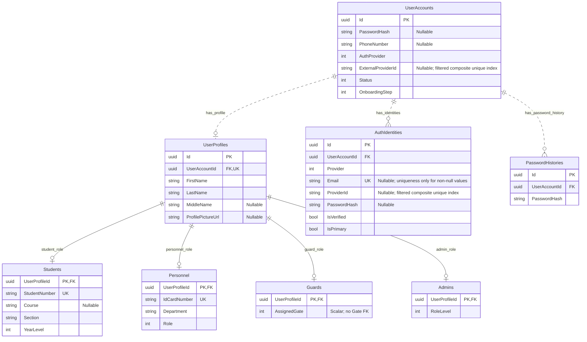
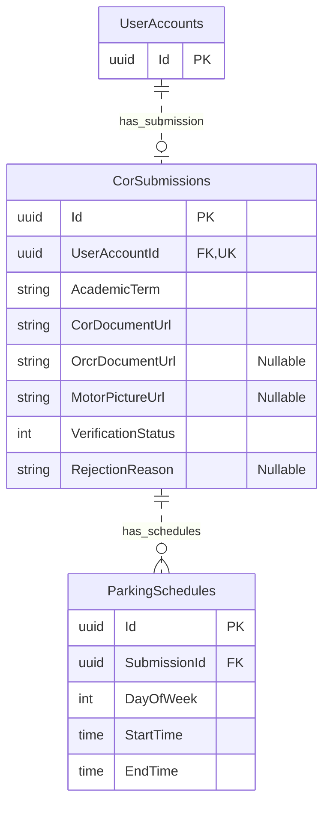
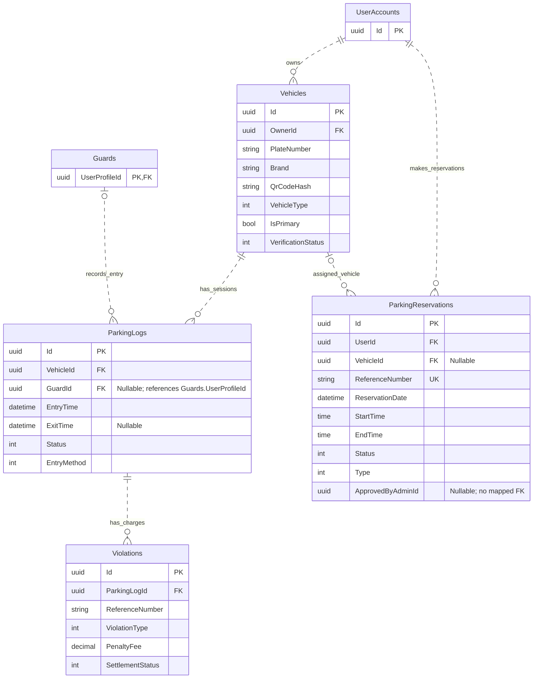
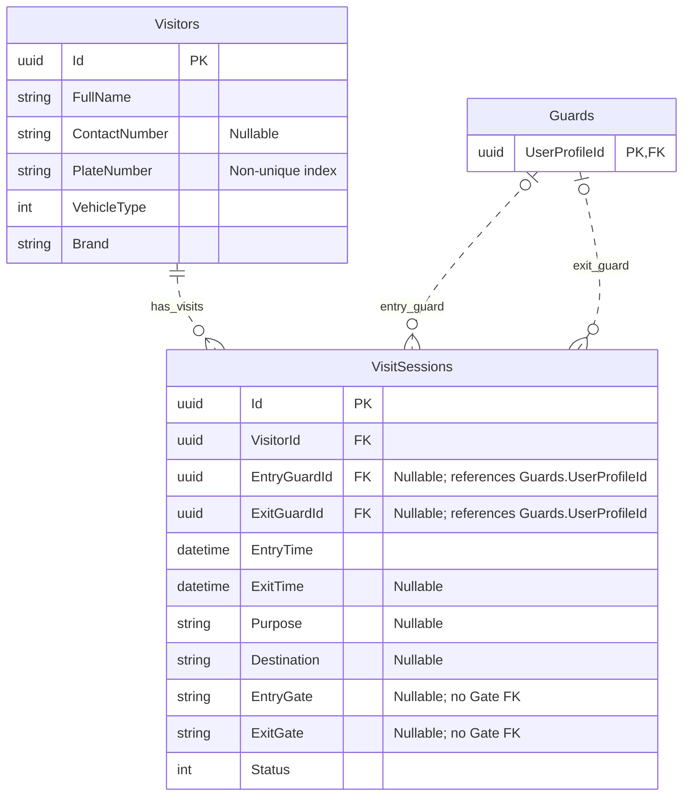
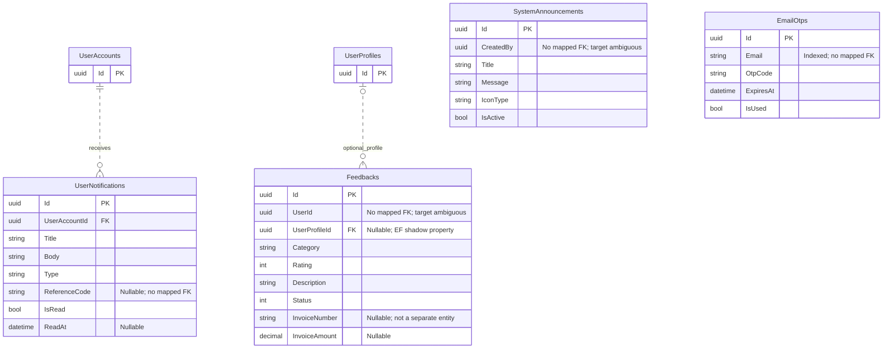

# ParkFlow backend EERD

Inspected: 2026-10-08. This is the **code-defined EF Core model**, not a verification of a running database. The whole-system diagram shows all 20 mapped entities and 20 relationships together. Five detailed ER views follow for readability. Repeated entities are references to the same table, not additional tables.

## Scope and notation

Sources: [Domain entities](../ParkFlow.Domain/Entities/), [AppDbContext](../ParkFlow.Persistence/AppDbContext.cs), and [entity configurations](../ParkFlow.Persistence/Configurations/). The migration snapshot was consulted **only for Feedback's unclear foreign key**; no application services, frontend, or mobile code was inspected for this document.

- Entity boxes use table names from the DbSets/configurations; attributes use CLR property names and simplified types. All primary and foreign keys are shown; non-key attributes are selected, not exhaustive.
- `PK`: primary key; `FK`: foreign key; `UK`: unique key. `Nullable` means the column permits null. Enum attributes are represented as `int`.
- `||`: exactly one; `o|` / `|o`: zero or one; `o{`: zero or many. Minimum participation reflects database constraints, not application onboarding rules.
- Solid `--` links identify shared-primary-key role records. Dotted `..` links have foreign keys outside the dependent's primary key; a dotted line does **not** imply that the FK is nullable.
- No explicit N:M relationship, skip navigation, or junction entity is mapped. Two 1:N relationships are not automatically treated as an N:M relationship.

## Whole-system EERD

All mapped entities, primary keys, and foreign keys appear in this single diagram. Selected non-key attributes are retained from the detailed views. Disconnected EmailOtps and SystemAnnouncements are intentional: no relationships are mapped for them. Ambiguous IDs are not marked as foreign keys or connected to guessed targets. Role-specialization links use the actual shared-primary-key relationships; CLR inheritance and its limitations are explained under **Inheritance and EER interpretation** below.

```mermaid
erDiagram
    direction TB

    UserAccounts ||..o| UserProfiles : has_profile
    UserAccounts ||..o{ AuthIdentities : has_identities
    UserAccounts ||..o{ PasswordHistories : has_password_history
    UserProfiles ||--o| Students : student_role
    UserProfiles ||--o| Personnel : personnel_role
    UserProfiles ||--o| Guards : guard_role
    UserProfiles ||--o| Admins : admin_role
    UserAccounts ||..o| CorSubmissions : has_submission
    CorSubmissions ||..o{ ParkingSchedules : has_schedules
    UserAccounts ||..o{ Vehicles : owns
    Vehicles ||..o{ ParkingLogs : has_sessions
    Guards |o..o{ ParkingLogs : records_entry
    ParkingLogs ||..o{ Violations : has_charges
    UserAccounts ||..o{ ParkingReservations : makes_reservations
    Vehicles |o..o{ ParkingReservations : assigned_vehicle
    Visitors ||..o{ VisitSessions : has_visits
    Guards |o..o{ VisitSessions : entry_guard
    Guards |o..o{ VisitSessions : exit_guard
    UserAccounts ||..o{ UserNotifications : receives
    UserProfiles |o..o{ Feedbacks : optional_profile

    UserAccounts {
        uuid Id PK
        string PasswordHash "Nullable"
        string PhoneNumber "Nullable"
        int AuthProvider
        string ExternalProviderId "Nullable; filtered composite unique index"
        int Status
        int OnboardingStep
    }
    UserProfiles {
        uuid Id PK
        uuid UserAccountId FK, UK
        string FirstName
        string LastName
        string MiddleName "Nullable"
        string ProfilePictureUrl "Nullable"
    }
    Students {
        uuid UserProfileId PK, FK
        string StudentNumber UK
        string Course "Nullable"
        string Section
        int YearLevel
    }
    Personnel {
        uuid UserProfileId PK, FK
        string IdCardNumber UK
        string Department
        int Role
    }
    Guards {
        uuid UserProfileId PK, FK
        int AssignedGate "Scalar; no Gate FK"
    }
    Admins {
        uuid UserProfileId PK, FK
        int RoleLevel
    }
    AuthIdentities {
        uuid Id PK
        uuid UserAccountId FK
        int Provider
        string Email UK "Nullable; uniqueness only for non-null values"
        string ProviderId "Nullable; filtered composite unique index"
        string PasswordHash "Nullable"
        bool IsVerified
        bool IsPrimary
    }
    PasswordHistories {
        uuid Id PK
        uuid UserAccountId FK
        string PasswordHash
    }
    CorSubmissions {
        uuid Id PK
        uuid UserAccountId FK, UK
        string AcademicTerm
        string CorDocumentUrl
        string OrcrDocumentUrl "Nullable"
        string MotorPictureUrl "Nullable"
        int VerificationStatus
        string RejectionReason "Nullable"
    }
    ParkingSchedules {
        uuid Id PK
        uuid SubmissionId FK
        int DayOfWeek
        time StartTime
        time EndTime
    }
    Vehicles {
        uuid Id PK
        uuid OwnerId FK
        string PlateNumber
        string Brand
        string QrCodeHash
        int VehicleType
        bool IsPrimary
        int VerificationStatus
    }
    ParkingLogs {
        uuid Id PK
        uuid VehicleId FK
        uuid GuardId FK "Nullable; references Guards.UserProfileId"
        datetime EntryTime
        datetime ExitTime "Nullable"
        int Status
        int EntryMethod
    }
    ParkingReservations {
        uuid Id PK
        uuid UserId FK
        uuid VehicleId FK "Nullable"
        string ReferenceNumber UK
        datetime ReservationDate
        time StartTime
        time EndTime
        int Status
        int Type
        uuid ApprovedByAdminId "Nullable; no mapped FK"
    }
    Violations {
        uuid Id PK
        uuid ParkingLogId FK
        string ReferenceNumber
        int ViolationType
        decimal PenaltyFee
        int SettlementStatus
    }
    Visitors {
        uuid Id PK
        string FullName
        string ContactNumber "Nullable"
        string PlateNumber "Non-unique index"
        int VehicleType
        string Brand
    }
    VisitSessions {
        uuid Id PK
        uuid VisitorId FK
        uuid EntryGuardId FK "Nullable; references Guards.UserProfileId"
        uuid ExitGuardId FK "Nullable; references Guards.UserProfileId"
        datetime EntryTime
        datetime ExitTime "Nullable"
        string Purpose "Nullable"
        string Destination "Nullable"
        string EntryGate "Nullable; no Gate FK"
        string ExitGate "Nullable; no Gate FK"
        int Status
    }
    UserNotifications {
        uuid Id PK
        uuid UserAccountId FK
        string Title
        string Body
        string Type
        string ReferenceCode "Nullable; no mapped FK"
        bool IsRead
        datetime ReadAt "Nullable"
    }
    Feedbacks {
        uuid Id PK
        uuid UserId "No mapped FK; target ambiguous"
        uuid UserProfileId FK "Nullable; EF shadow property"
        string Category
        int Rating
        string Description
        int Status
        string InvoiceNumber "Nullable; not a separate entity"
        decimal InvoiceAmount "Nullable"
    }
    SystemAnnouncements {
        uuid Id PK
        uuid CreatedBy "No mapped FK; target ambiguous"
        string Title
        string Message
        string IconType
        bool IsActive
    }
    EmailOtps {
        uuid Id PK
        string Email "Indexed; no mapped FK"
        string OtpCode
        datetime ExpiresAt
        bool IsUsed
    }
```

## 1. Accounts, authentication, and role specialization

An account can exist without a profile; each existing profile requires exactly one account. Each role record requires exactly one profile, but a profile may have no record of a particular role.

Additional uniqueness constraints:

- `UserAccounts(AuthProvider, ExternalProviderId)` is unique where `ExternalProviderId IS NOT NULL`.
- `AuthIdentities(Provider, ProviderId)` is unique where `ProviderId IS NOT NULL`.
- `AuthIdentities.UserAccountId` is unique **only where `IsPrimary = true`**: at most one primary identity per account, not at most one identity overall.

### Inheritance and EER interpretation

`BaseEntity` is an abstract CLR base class carrying `Id` (Guid), `CreatedAt` (DateTime), and nullable `UpdatedAt` (DateTime). These attributes are inherited by the following 16 concrete entities:

`UserAccount`, `UserProfile`, `AuthIdentity`, `PasswordHistory`, `EmailOtp`, `CorSubmission`, `ParkingSchedule`, `Vehicle`, `ParkingLog`, `ParkingReservation`, `Violation`, `Visitor`, `VisitSession`, `Feedback`, `SystemAnnouncement`, and `UserNotification`.

There is no `BaseEntity` DbSet, entity configuration, or separate base-table relationship in the inspected model. Its inherited audit columns are omitted from the diagrams to reduce repetition; inherited `Id` is shown in every relevant entity. No TPH discriminator or explicit TPT/TPC inheritance mapping is configured in these sources.

`Student`, `Personnel`, `Guard`, and `Admin` **do not inherit from `UserProfile` in C#**. Their shared-PK 1:1 links support a conceptual role-specialization view, shown above, but are composition in the implementation. The mappings do not require every profile to have a role record and do not enforce mutually exclusive role tables. Therefore, total/disjoint specialization must not be asserted. Personnel categories use `Personnel.Role`; admin levels use `Admin.RoleLevel`, rather than additional subtype tables. Mermaid ER syntax has no native ISA connector; the labeled shared-PK links plus this explanation express that distinction without inventing inheritance FKs.

## 2. Document verification and schedules

The unique account FK permits **at most one CorSubmission per account**, not one per academic term. Schedules reference the submission, not Student or Personnel directly. The schema alone does not enforce which roles may have schedules or what document `CorDocumentUrl` contains.

## 3. Registered vehicles, parking, reservations, and charges

Each reservation requires an account and may reference a vehicle. Each registered parking log requires a vehicle and may reference a guard. Each violation requires a parking log; a log may have multiple violations/charges. `Violation` has no dedicated configuration; its required navigation and non-null `ParkingLogId` establish the 1:N relationship by EF convention.

There is no direct reservation-to-parking-log FK. The mapped relationships do not enforce that a reservation's vehicle belongs to its `UserId`. Neither `Vehicles.PlateNumber` nor `Violations.ReferenceNumber` is configured as unique in the inspected sources; do not assume uniqueness from their business meaning.

## 4. Visitors and visit sessions

Visitor records contain their own vehicle details; there is no Visitor FK to UserAccounts or Vehicles. Entry and exit guard links are independent optional relationships. `VisitSession.ParkingFee` is a CLR constant, not a mapped column. There is no mapped link from VisitSessions to Violations or to a separate payment entity.

## 5. Notifications, feedback, announcements, and email OTPs

Announcements and OTPs are deliberately disconnected: their scalar identifiers/email do not establish EF relationships. Notification reference codes and copied driver/vehicle fields are not mapped relationships.

## Foreign-key inventory and optionality

All targets are `Id` unless otherwise stated. `1:N` means a principal can have zero or many dependents; `1:1` below means a principal can have zero or one dependent. **No principal is required by these mappings to have a dependent.** Required/optional refers to the principal for each dependent row.

| Dependent FK | Principal target | Cardinality | Principal per dependent | On delete |
|---|---|---|---|---|
| UserProfiles.UserAccountId | UserAccounts.Id | 1:1 | Exactly 1 | Cascade |
| Students.UserProfileId (also PK) | UserProfiles.Id | 1:1 | Exactly 1 | Cascade |
| Personnel.UserProfileId (also PK) | UserProfiles.Id | 1:1 | Exactly 1 | Cascade |
| Guards.UserProfileId (also PK) | UserProfiles.Id | 1:1 | Exactly 1 | Cascade |
| Admins.UserProfileId (also PK) | UserProfiles.Id | 1:1 | Exactly 1 | Cascade |
| AuthIdentities.UserAccountId | UserAccounts.Id | 1:N | Exactly 1 | Cascade |
| PasswordHistories.UserAccountId | UserAccounts.Id | 1:N | Exactly 1 | Cascade |
| CorSubmissions.UserAccountId | UserAccounts.Id | 1:1 | Exactly 1 | Cascade |
| ParkingSchedules.SubmissionId | CorSubmissions.Id | 1:N | Exactly 1 | Cascade |
| Vehicles.OwnerId | UserAccounts.Id | 1:N | Exactly 1 | Cascade |
| ParkingLogs.VehicleId | Vehicles.Id | 1:N | Exactly 1 | Cascade |
| ParkingLogs.GuardId | Guards.UserProfileId | 1:N | 0 or 1 | SetNull |
| ParkingReservations.UserId | UserAccounts.Id | 1:N | Exactly 1 | Cascade |
| ParkingReservations.VehicleId | Vehicles.Id | 1:N | 0 or 1 | SetNull |
| Violations.ParkingLogId | ParkingLogs.Id | 1:N | Exactly 1 | Cascade (EF convention) |
| VisitSessions.VisitorId | Visitors.Id | 1:N | Exactly 1 | Cascade |
| VisitSessions.EntryGuardId | Guards.UserProfileId | 1:N | 0 or 1 | SetNull |
| VisitSessions.ExitGuardId | Guards.UserProfileId | 1:N | 0 or 1 | SetNull |
| UserNotifications.UserAccountId | UserAccounts.Id | 1:N | Exactly 1 | Cascade |
| Feedbacks.UserProfileId (shadow) | UserProfiles.Id | 1:N | 0 or 1 | ClientSetNull (EF convention) |

`ClientSetNull` is EF's behavior for tracked dependents, not a database `ON DELETE SET NULL` guarantee.

## Ambiguities and intentionally omitted relationships

1. **Feedback.UserId:** the entity has a scalar `UserId` and a nullable `UserProfile` navigation, but no FK attribute/configuration connects them. To resolve the physical mapping, only the Feedback sections of [AppDbContextModelSnapshot](../ParkFlow.Persistence/Migrations/AppDbContextModelSnapshot.cs) were consulted: they confirm a nullable shadow `UserProfileId` FK to UserProfiles, separate from `UserId`. The intended target/meaning of `UserId` remains ambiguous. No UserAccounts edge is guessed.
2. **ParkingReservation.ApprovedByAdminId:** nullable scalar, no navigation or FK configuration. The intended target/key cannot be established from these sources. No Admins edge is drawn.
3. **SystemAnnouncement.CreatedBy:** non-null Guid, no navigation or FK configuration. Its name does not establish whether it targets an account or admin profile. No creator edge is drawn.
4. **Role specialization:** role-record links are real, but disjointness, completeness, and authorization policy are not database-enforced by the inspected mappings. These are not depicted as guaranteed ISA constraints.
5. **No invented entities:** AppDbContext does not map separate Payment, Collection, Invoice, Gate, ParkingSlot, Capacity, or SystemSettings entities. Feedback invoice fields and violation settlement fields remain attributes of their actual entities. Runtime settings or fee rules outside the requested inspection scope are not modeled as tables.

No application code or migrations were modified. This document describes the existing model, including its ambiguities, rather than proposing a replacement schema.
